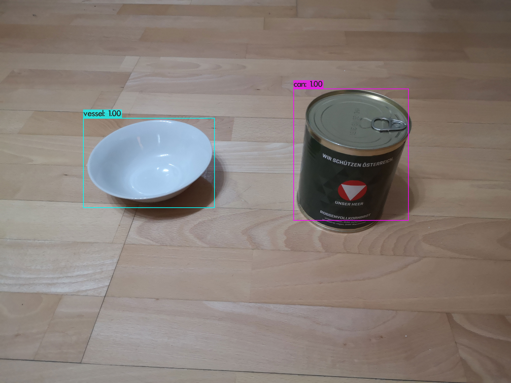
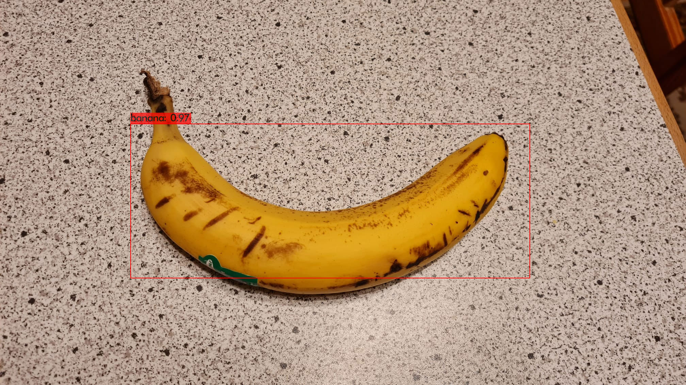
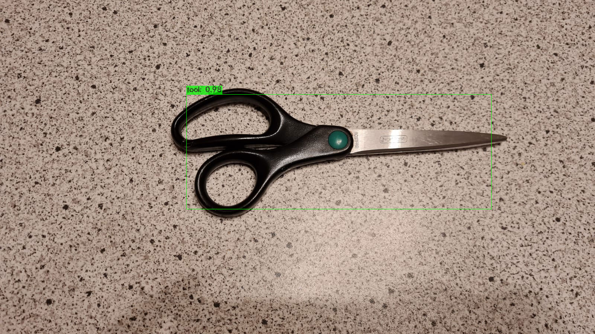
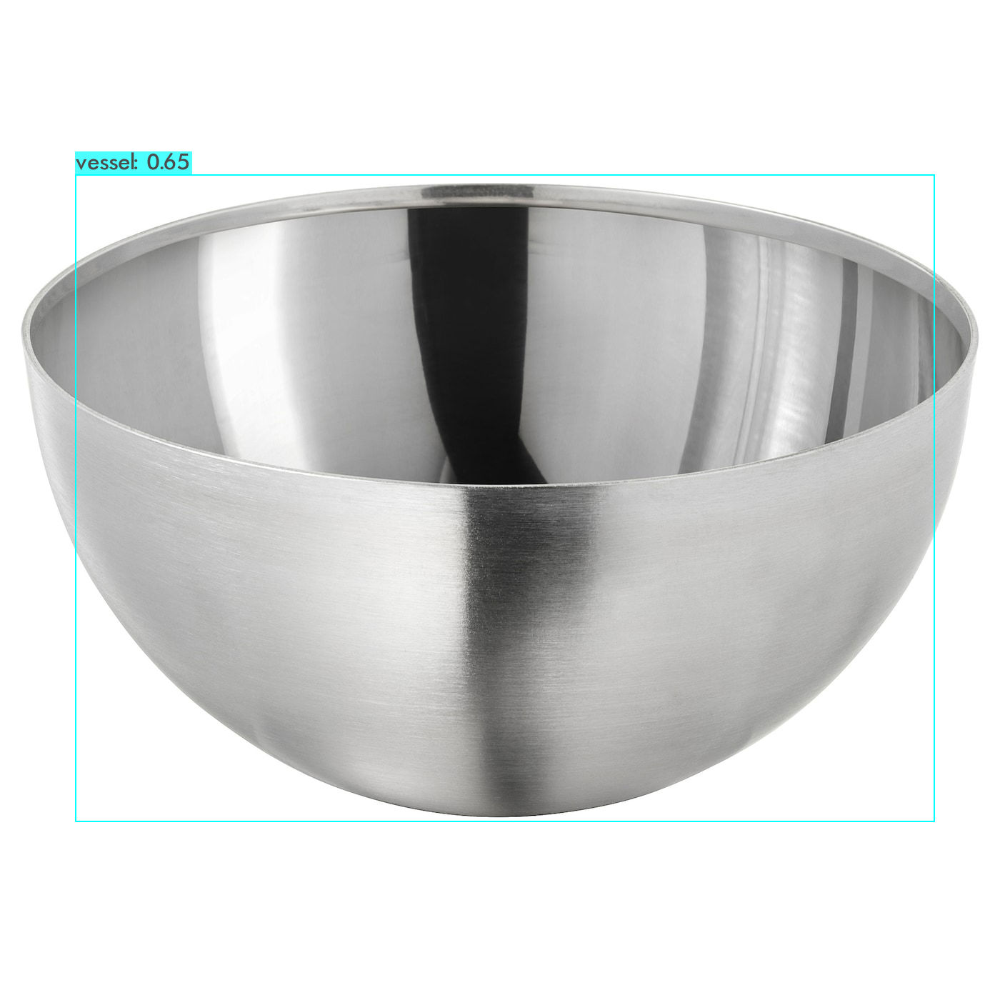
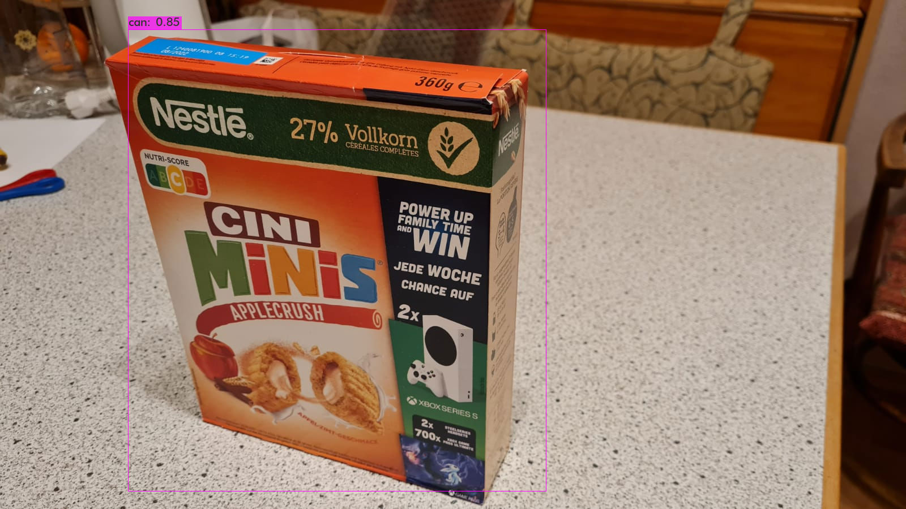
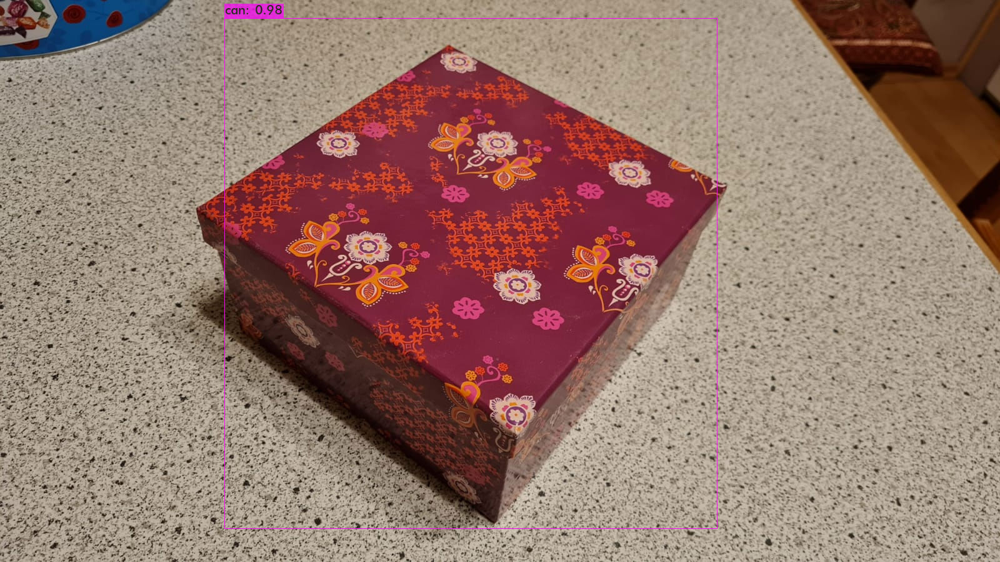

# MUS2_ObjectDetection
# Category-level Object Detection
## Michael Schebek, Elisabeth Gittenberger

### Angabe
Detektion von ungesehenen Objekten und Klassifizierung der zugehörigen Objektkategorie. Annotieren
Sie Bilder des YCB-video Datensatzes ([https://rse-lab.cs.washington.edu/projects/posecnn/](https://rse-lab.cs.washington.edu/projects/posecnn/)) auf
"category-level" und Trainieren Sie einen beliebigen Object Detector (z.B.: Yolo mini). Nehmen Sie
Bilder von Objekten (die nicht im Trainingssatz enhalten sind) der jeweiligen Kategorien auf und
evaluieren Sie die wie gut die Detektion auf diesen ungesehenen Objekten funktioniert. C++/Python and
Tensorflow.

### Verwendete Mittel

- Nvidia RTX 2070 Super
- Python 3.9
- Ubuntu 20.04
- Nvidia Cuda 11.5
- Nvidia CUDNN Library
- OpenCV 4.4.5
- Object Detector
	- Als Object Detector wurde YOLOv3 (welches?) ausgewählt, da dieser im Vergleich zu anderen Object Deterctoren sowohl 
schnell als auch genau ist. ([https://pjreddie.com/darknet/yolo/](https://pjreddie.com/darknet/yolo/)) YOLOv3 wurde von Joseph Chet Redmon und Ali Farhadi entwickelt. YOLO Versionen sind in Neural Network Frameworks 
wie Tensorflow und Darknet implementiert. Bei Darknet handelt es sich um ein Framework, dass von den Entwicklern
von YOLO stammt. Es wurde sich daher entschieden Darknet als Framework für die Anwendung heranzuziehen.
- Datensatz
	- Als Datensatz wurden Bilder des YCB-video Datensatzes herangezogen. Der Download des Datensatzen über die in der 
Projektbeschreibung angegeben Quelle funktionierte auch nach mehrfachen Versuchen nicht. Aus diesem Grund wurde der 
Datensatz aus einer alternativen Quelle bezogen. Hier wurde der Datensatz teilweise für das trainieren eines YOLO Objekt
Detectors erweitert und für einfacheren Download optimiert. ([https://okabe.dev/ycb-video-dataset-download-mirror/](https://okabe.dev/ycb-video-dataset-download-mirror/))

### Geänderte Files
Der Datensatz wurde dabei verwednet, die Klassen wurden jedoch anders annotiert. So wurden die 21 vorhandenen Klassen auf 5 neue Klassen zusammengefasst.
Diese geänderte Annotierung erfolgte wie folgt:

- Klasse 0 "can"
	- "002_master_chef_can"
	- "005_tomato_soup_can"
	- "007_tuna_fish_can"
	- "010_potted_meat_can"
- Klasse 1 "box"
	- "003_cracker_box"
	- "004_sugar_box"
	- "008_pudding_box"
	- "009_gelatin_box"
	- "036_wood_block"
	- "061_foam_brick"
- Klasse 2 "vessel"
	- "006_mustard_bottle"
	- "019_pitcher_base"
	- "021_bleach_cleanser"
	- "024_bowl"
	- "025_mug"
- Klasse 3 "banana"
	- "011_banana"
- Klasse 4 "tool"
	- "035_power_drill"
	- "037_scissors"
	- "040_large_marker"
	- "051_large_clamp"
	- "052_extra_large_clamp"

Zur Änderung der Annotierung wurden die classes.txt, \*-box.txt und \*-color.txt Files bearbeitet. Im classes.txt im /yolo
Ordner des Datensatzes wurden die ursprünglichen 21 Klassen mit den neuen 5 ersetzt, das File wurde in newclasses.txt umbenannt. 
Dann wurde im *-box.txt File jedes Bildes die respektiven Klassennamen ersetzt. Hier sind die Klassen der im Bild befindlichen Objekte 
und die zugehörigen Koordinatend der Boundig Box notiert. Dies erfolgte mit "box.py". Anschließend wurden im \*-color.txt File
jedes Bildes, wo die Farben der jeweiligen Objekte angegeben sind, die Nummer der Klassen auf die neuen Klassennummern geändert. 
Dies erfolgte mit "color.py".

Zur Anpassung des Netzwerkes wurden die .cfg Files des Netwerkes angepasst. Als Ausgangspunkt wurde das yolov3.cfg
verwendet. Es wurden zwei .cfg Files erstellt, eines für das Trainieren yolov3-ycb-train.cfg und eines für das Testen yolov3-ycb-test.cfg.
Es wurden folgende Änderungen der Einstellungen vorgenommen nach der Anleitung von ([https://github.com/AlexeyAB/darknet](https://github.com/AlexeyAB/darknet)):
 
- In yolov3-ycb-train.cfg: 
	- batch = 64
	- subdivisions = 16
- In yolov3-ycb-test.cfg:
	- batch = 1
	- subdivisions = 1
- Allgemein:
	- max_batches = 10000 (Klassen * 2000)
	- steps=8000,9000 (80% und 90% der max_batches)
	- In jedem der 3 yolo Layers:
		- classes = 5
	- In jedem der 3 convolutional Layers, vor jedem yolo Layer
		- filters = 30 (Klassen + 5) * 3

### Build Anweisungen (auf Linux)

1. Laden und extrahieren Sie den Datensatz von der oben angegebenen Quelle (SSD empfohlen)
2. Clonen Sie darknet von github in den Ordner /yolo des Datensatzes ([https://github.com/pjreddie/darknet](https://github.com/pjreddie/darknet))
3. Bearbeiten Sie das Makefile gemäß Ihrer Konfiguration. Für dieses Projekt wurden folgende Einstellungen geändert:
	- Grafikkarte vorhanden: GPU = 1
	- Nvidia CUDNN Library vorhanden: CUDNN = 1
	- OpenCV 4 vorhanden: OPENCV = 1
4. Compilieren Sie mit den Befehl $make
5. Laden Sie darknet53.conv.74, die pre-trained weights für YOLOv3 herunter und kopieren Sie es in /yolo ([https://pjreddie.com/media/files/darknet53.conv.74](https://pjreddie.com/media/files/darknet53.conv.74))
6. Clonen Sie den / Ordner aus dem Team-github
7. Kopieren Sie box.py und color.py in den /data Ordner des Datensatzes und die restlichen Files in den /yolo
Ordner des Datensatzes
8. Führen Sie box.py und color.py im /data Ordner des Datensatzes aus, die Annotierungen werden auf die neuen Klassen geändert
9. Erstellen Sie im /yolo Ordner des Datensatzes einen backup Ordner mit $mkdir backup, hier werden die mit dem 
Netzwerk trainierten weights abgespeichert
10. Führen Sie train.sh im /yolo Ordner des Datensatzes aus um das Netzwerk zu trainieren
11. Führen Sie test.sh im /yolo Ordner des Datensatzes aus um ein neues Bild zu klassifizieren, Sie werden aufgefordert
den Pfad des Bildes anzugeben, das Ergebnis wird als .jpg in den /yolo Ordner des Datensatzes abgespeichert

### Ergebnisse und Ausblick
Im Ordner Results befinden sich allen klassifizierten Bilder sowie ein Video und das 
.weights File des mit den oben angegeben Parametern trainierten Netzwerks.

Das Netwerk wurde insgesamt mit 640 000 Bildern trainiert. Im Datensatz sind 133 827 Bilder 
enthalten die mehrmals und in zufälliger Reihenfolge in Netzwerk gespeist werden (siehe train.txt und test.txt).
Es wurden 10 000 Iterationen trainiert.

Allgemein kann gesagt werden, dass die Klassifizierung gut für Bilder funktioniert die nicht im
Datensatz enthalten sind die den ursprünglichen Bildern ähneln. Beispiele sind auf den folgenden Bildern zu sehen.

Allerdings werden Objekte bei manchen Bilder falsch klassifiziert oder 
schlecht erkannt. Bei den Klasse box treten die meisten Fehler auf. Dies ist auf folgenden Bildern zu sehen.

Die Fehler sind wahrscheinlich darauf zurückzuführen, dass nur 21 verschiedene Objekte verwendet wurden um das Netzwerk zu trainieren.
Um bessere Ergebnisse zu erziehlen sollten mehr verscheidene Objekte pro Klasse verwendet werden.
Der zu verwendende Datensatz wurde für eine Pose Estimation der verwendeten 21 Objekten erstellt und nicht 
spezifisch um im Datensatz nicht enthaltene Objekte zu erkennen.
